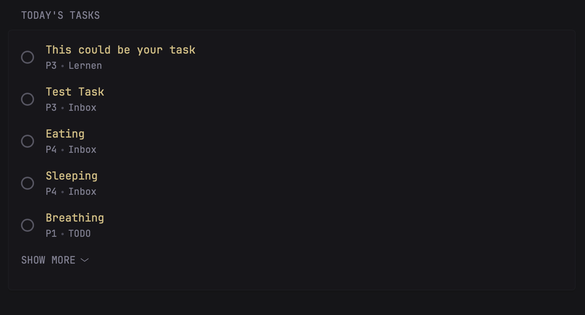

```yaml
- type: custom-api
  title: "Today's Tasks"
  cache: 5m
  url: https://api.todoist.com/rest/v2/tasks?filter=today
  method: GET
  headers:
    Authorization: Bearer ${TODOIST_API_TOKEN}
  template: |
    <style>
      .task-row-todoist {
        display: flex;
        align-items: center;
        gap: 16px;
      }
      .task-checkbox-todoist {
        width: 18px;
        height: 18px;
        border: 2px solid currentColor;
        border-radius: 50%;
        flex-shrink: 0;
        cursor: pointer;
        opacity: 0.6;
        background: transparent;
        padding: 0;
        transition: opacity 0.2s;
      }
      .task-checkbox-todoist:hover {
        opacity: 1;
      }
      .task-content-wrapper-todoist {
        flex: 1;
        min-width: 0;
      }
      .task-row-todoist.completing {
        opacity: 0.5;
        pointer-events: none;
      }
    </style>
    {{ $tasks := .JSON.Array "" }}
    {{ if $tasks }}
      <ul class="list list-gap-14 collapsible-container" data-collapse-after="5">
        {{ range $tasks }}
          <li>
            <div class="task-row-todoist">
              <button class="task-checkbox-todoist"
                      onclick="(function(btn) {
                        const taskRow = btn.closest('.task-row-todoist');
                        taskRow.classList.add('completing');
                        fetch('https://api.todoist.com/rest/v2/tasks/{{ .String "id" }}/close', {
                          method: 'POST',
                          headers: { 'Authorization': 'Bearer ${TODOIST_API_TOKEN}' }
                        })
                        .then(r => {
                          if (r.ok) {
                            const li = btn.closest('li');
                            li.style.transition = 'opacity 0.3s';
                            li.style.opacity = '0';
                            setTimeout(() => li.remove(), 300);
                          } else {
                            taskRow.classList.remove('completing');
                            r.text().then(t => console.error('Failed:', t));
                          }
                        })
                        .catch(e => {
                          taskRow.classList.remove('completing');
                          console.error('Error:', e);
                        });
                      })(this); return false;"
                      title="Complete task"></button>
              <div class="task-content-wrapper-todoist">
                <a class="size-h3 color-primary" href="https://app.todoist.com/app/task/{{ .String "id" }}" target="_blank">
                  {{ .String "content" }}
                </a>
                <ul class="list-horizontal-text">
                  {{ $priority := .Int "priority" }}
                  {{ if eq $priority 4 }}
                    <li>P1</li>
                  {{ else if eq $priority 3 }}
                    <li>P2</li>
                  {{ else if eq $priority 2 }}
                    <li>P3</li>
                  {{ else }}
                    <li>P4</li>
                  {{ end }}
                  {{ if .String "project_id" }}
                    <li data-project-id="{{ .String "project_id" }}">{{ .String "project_id" }}</li>
                  {{ end }}
                </ul>
              </div>
            </div>
          </li>
        {{ end }}
      </ul>
       r.json())
        .then(projects => {
          const projectMap = {};
          projects.forEach(p => projectMap[String(p.id)] = p.name);
          document.querySelectorAll('[data-project-id]').forEach(el => {
            const projectName = projectMap[String(el.getAttribute('data-project-id'))];
            if (projectName) el.textContent = projectName;
          });
        });
      })(); this.parentNode.removeChild(this);" style="display:none;">
    {{ else }}
      <p class="color-subdue">No tasks due today</p>
    {{ end }}
```

## Environment Variables

- `TODOIST_API_TOKEN` - Your Todoist API token. Get it from [Todoist Settings → Integrations → Developer](https://todoist.com/prefs/integrations) under the "API token" section.

## Features

- Displays all tasks due today from Todoist
- Interactive checkboxes to complete tasks directly from the widget
- Shows priority levels (P1-P4)
- Displays project names for each task
- Click on task title to open it in Todoist
- Collapsible list (shows first 5 tasks, click to expand)
- Smooth fade-out animation when completing tasks

## Setup

1. Get your Todoist API token:
   - Go to [Todoist Settings → Integrations](https://todoist.com/prefs/integrations)
   - click on the "Developer" section
   - Copy your API token

2. Add the API token to your Glance .env:
   ```yaml
     TODOIST_API_TOKEN=your-api-token-here
   ```

3. Add this widget to your Glance dashboard configuration

## Notes

- The widget refreshes every 5 minutes
- Completing a task via the checkbox immediately removes it from the list
- The widget uses Todoist's REST API v2
- For more filter options, see the [Todoist API documentation](https://developer.todoist.com/rest/v2/#get-active-tasks)
