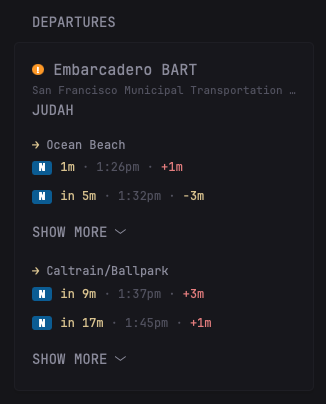
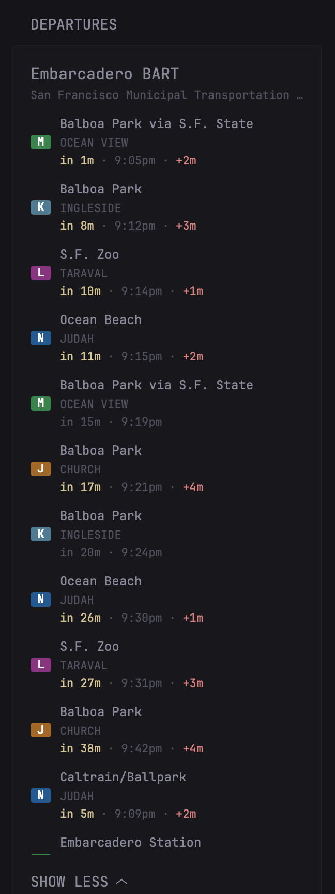
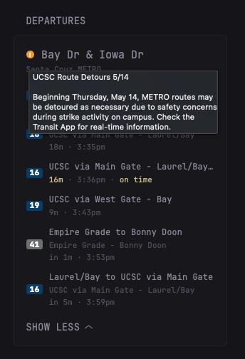

# Transit Departures Widget for Glance

Live transit departures at any stop, powered by the [Transitland](https://www.transit.land) v2 REST API. Works with any agency Transitland indexes (BART, Muni, MTA, SEPTA, MARTA, BC Transit, and many more. See [transit.land/operators](https://www.transit.land/operators)).

## States

The widget adapts to whatever the API returns. A few common scenarios:

| Filtered to one line | Unfiltered | Service alert |
| --- | --- | --- |
| |  |  |

### Filtered to a single line (multi-direction)

Both directions appear in their own sub-list with a `→ destination` header. Each sub-list collapses independently. The direction with the sooner next train always renders on top.

### Unfiltered - multiple routes at one stop

Each (route, direction) combination gets up to 2 rows showing its soonest departures (tweakable via `$perRouteCap` in the template). Within a single platform, sorted by next departure. 

*For parent stations with multiple child platforms (BART, NYC subway, etc.) ordering is approximate across platforms because Glance's template language has no list-merge primitive.*

### Service alert active

A `!` badge appears next to the stop name (`var(--color-primary)` for `DETOUR`/`MODIFIED_SERVICE`, `var(--color-negative)` for `NO_SERVICE`/`SIGNIFICANT_DELAYS`). Hover for the full alert description.

Features:

- **Real-time delays** - `+2m late`, `-1m early`, or `on time`, alongside scheduled clock time and a live countdown
- **Multi-platform stations** - automatically walks `children[]` so parent stops like BART's Embarcadero or NYC subway hubs work without picking a specific platform ID
- **Direction split** - when filtered to one route, splits into "→ destination A" / "→ destination B" sub-lists, each with its own collapsible "Show more"; the direction with the sooner next train always renders on top
- **Dedupe across routes** - when no route filter is set, shows up to 2 departures per (route, direction) so a frequent line doesn't crowd out infrequent ones
- **Service alerts** - surfaces as a `!` badge in the header with the full alert description on hover
- **Cancellations & added trips** - strikethrough for `CANCELED`, `+ ADDED` tag for ad-hoc trips
- **Theme-aware colors** - uses Glance's CSS variables, looks right in light and dark themes

## Prerequisites

You will need two environment variables set in your Glance environment:

1. `TRANSITLAND_API_KEY`: A free API key from [transit.land/operators](https://www.transit.land/operators).
2. `TRANSITLAND_STOP_KEY`: The Onestop ID of the stop you want to track (e.g. `s-9q9k659jh1-broadway~laurel`).

A third variable is optional:

1. `TRANSITLAND_ROUTE_ONESTOP_ID`: A Onestop ID for a single route (e.g. `r-9q9-yellow~n`) to filter the widget to one line. Useful at multi-line stations like BART. Leave empty to show every route serving the stop.

## Configuration

### 1. Get an free API key

Sign up at <https://www.transit.land/operators> and click **API access**. You'll get a long token, paste it into your `.env` as `TRANSITLAND_API_KEY`.

### 2. Find your stop's Onestop ID

Go to <https://www.transit.land>, search for your stop by name, and copy the Onestop ID from its page (it starts with `s-` and looks like `s-9q9k659jh1-broadway~laurel`). Paste it into your `.env` as `TRANSITLAND_STOP_KEY`.

If you're at a parent station (BART, NYC subway, etc.), the parent's Onestop ID works fine, the widget walks all child platforms automatically.

### 3. (Optional) Find a route's Onestop ID for filtering

At multi-line stations, set `TRANSITLAND_ROUTE_ONESTOP_ID` to the Onestop ID of the line you want to track (find it on the route's page on transit.land. It starts with `r-`). Each direction is its own route in Transitland (`r-9q8y-red~n` for northbound, `~s` for southbound), so pick the direction you ride. When set, the widget shows both direction headsigns split into sub-lists.

Leave the variable empty (or omit it) to show all routes at the stop in one combined list.

### 4. Place the following code in your dashboard

```yaml
- type: custom-api
  title: Departures
  cache: 1m
  url: https://transit.land/api/v2/rest/stops/${TRANSITLAND_STOP_KEY}/departures
  parameters:
    next: 3600
    limit: 20
    include_alerts: true
  headers:
    apikey: ${TRANSITLAND_API_KEY}
  template: |
    {{ define "depRow" }}
      {{ $est := .String "departure.estimated_utc" }}{{ $sched := .String "departure.scheduled_utc" }}{{ $estLocal := .String "departure.estimated_local" }}{{ $schedLocal := .String "departure.scheduled_local" }}{{ $isRT := and (ne $est "") (ne $est $sched) }}{{ $iso := $sched }}{{ $isoLocal := $schedLocal }}{{ if $isRT }}{{ $iso = $est }}{{ $isoLocal = $estLocal }}{{ end }}
      {{ $rs := .String "trip.route.route_short_name" }}{{ $rl := .String "trip.route.route_long_name" }}{{ $headsign := .String "trip.trip_headsign" }}{{ if eq $headsign "" }}{{ $headsign = .String "stop_headsign" }}{{ end }}{{ if eq $headsign "" }}{{ $headsign = $rl }}{{ end }}{{ $rc := findMatch "^[0-9A-Fa-f]{6}$" (.String "trip.route.route_color") }}{{ $rtc := findMatch "^[0-9A-Fa-f]{6}$" (.String "trip.route.route_text_color") }}{{ $rcStyle := "var(--color-text-subdue)" }}{{ if ne $rc "" }}{{ $rcStyle = print "#" $rc }}{{ end }}{{ $rtcStyle := "var(--color-widget-background)" }}{{ if ne $rtc "" }}{{ $rtcStyle = print "#" $rtc }}{{ end }}{{ $relation := .String "schedule_relationship" }}{{ $canceled := eq $relation "CANCELED" }}{{ $added := eq $relation "ADDED" }}
      <li {{ if $canceled }}style="opacity: 0.6;"{{ end }}>
        <div style="display: flex; align-items: center; gap: 0.85rem; min-width: 0;">
          <span class="size-h6" style="background:{{ safeCSS $rcStyle }}; color:{{ safeCSS $rtcStyle }}; border-radius:3px; font-weight:600; min-width: 2rem; height: 1.4rem; padding: 0 5px; display: inline-flex; align-items: center; justify-content: center; flex-shrink: 0;">{{ $rs }}</span>
          <div style="min-width: 0; flex-grow: 1;">
            <div class="size-h5 text-truncate" {{ if $canceled }}style="text-decoration: line-through;"{{ end }}>{{ $headsign }}{{ if $added }} <span class="size-h6 color-positive" style="font-weight: 600; padding-left: 4px;">+ ADDED</span>{{ end }}</div>
            {{ if and (ne $rl "") (ne $rl $headsign) }}<div class="size-h6 color-subdue text-truncate">{{ $rl }}</div>{{ end }}
            <div class="size-h6 text-truncate" style="white-space: nowrap;">
              {{ if $canceled }}<span class="color-negative" style="font-weight: 600;">CANCELED</span><span class="color-subdue"> · </span><span class="color-subdue" style="text-decoration: line-through;">{{ $isoLocal | parseTime "rfc3339" | formatTime "3:04pm" }}</span>
              {{ else }}<span class="{{ if $isRT }}color-positive{{ else }}color-subdue{{ end }}" {{ $iso | parseTime "rfc3339" | toRelativeTime }}></span><span class="color-subdue"> · </span><span class="color-subdue">{{ $isoLocal | parseTime "rfc3339" | formatTime "3:04pm" }}</span>{{ if $isRT }}{{ $delay := .Int "departure.estimated_delay" }}{{ $absDelay := absInt $delay }}{{ if le $absDelay 30 }}<span class="color-subdue"> · </span><span class="color-positive">on time</span>{{ else }}{{ $mins := div (add $absDelay 30) 60 }}{{ if gt $delay 0 }}<span class="color-subdue"> · </span><span class="color-negative">+{{ $mins }}m</span>{{ else }}<span class="color-subdue"> · </span><span class="color-positive">-{{ $mins }}m</span>{{ end }}{{ end }}{{ end }}{{ end }}
            </div>
          </div>
        </div>
      </li>
    {{ end }}
    {{ define "depRowJustTime" }}
      {{ $est := .String "departure.estimated_utc" }}{{ $sched := .String "departure.scheduled_utc" }}{{ $estLocal := .String "departure.estimated_local" }}{{ $schedLocal := .String "departure.scheduled_local" }}{{ $isRT := and (ne $est "") (ne $est $sched) }}{{ $iso := $sched }}{{ $isoLocal := $schedLocal }}{{ if $isRT }}{{ $iso = $est }}{{ $isoLocal = $estLocal }}{{ end }}
      {{ $rs := .String "trip.route.route_short_name" }}{{ $rc := findMatch "^[0-9A-Fa-f]{6}$" (.String "trip.route.route_color") }}{{ $rtc := findMatch "^[0-9A-Fa-f]{6}$" (.String "trip.route.route_text_color") }}{{ $rcStyle := "var(--color-text-subdue)" }}{{ if ne $rc "" }}{{ $rcStyle = print "#" $rc }}{{ end }}{{ $rtcStyle := "var(--color-widget-background)" }}{{ if ne $rtc "" }}{{ $rtcStyle = print "#" $rtc }}{{ end }}{{ $relation := .String "schedule_relationship" }}{{ $canceled := eq $relation "CANCELED" }}{{ $added := eq $relation "ADDED" }}
      <li {{ if $canceled }}style="opacity: 0.6;"{{ end }}>
        <div style="display: flex; align-items: center; gap: 0.85rem; min-width: 0;">
          <span class="size-h6" style="background:{{ safeCSS $rcStyle }}; color:{{ safeCSS $rtcStyle }}; border-radius:3px; font-weight:600; min-width: 2rem; height: 1.4rem; padding: 0 5px; display: inline-flex; align-items: center; justify-content: center; flex-shrink: 0;">{{ $rs }}</span>
          <div class="size-h5 text-truncate" style="min-width: 0; flex-grow: 1; white-space: nowrap;">
            {{ if $canceled }}<span class="color-negative" style="font-weight: 600;">CANCELED</span><span class="color-subdue"> · </span><span class="color-subdue" style="text-decoration: line-through;">{{ $isoLocal | parseTime "rfc3339" | formatTime "3:04pm" }}</span>
            {{ else }}<span class="{{ if $isRT }}color-positive{{ else }}color-subdue{{ end }}" {{ $iso | parseTime "rfc3339" | toRelativeTime }}></span><span class="color-subdue"> · </span><span class="color-subdue">{{ $isoLocal | parseTime "rfc3339" | formatTime "3:04pm" }}</span>{{ if $isRT }}{{ $delay := .Int "departure.estimated_delay" }}{{ $absDelay := absInt $delay }}{{ if le $absDelay 30 }}<span class="color-subdue"> · </span><span class="color-positive">on time</span>{{ else }}{{ $mins := div (add $absDelay 30) 60 }}{{ if gt $delay 0 }}<span class="color-subdue"> · </span><span class="color-negative">+{{ $mins }}m</span>{{ else }}<span class="color-subdue"> · </span><span class="color-positive">-{{ $mins }}m</span>{{ end }}{{ end }}{{ end }}{{ end }}{{ if $added }} <span class="size-h6 color-positive" style="font-weight: 600; padding-left: 4px;">+ ADDED</span>{{ end }}
          </div>
        </div>
      </li>
    {{ end }}
    {{ $routeFilter := "${TRANSITLAND_ROUTE_ONESTOP_ID}" }}
    {{ $any := false }}
    {{ range .JSON.Array "stops" }}
      {{ $stop := . }}
      {{ $stopName := .String "stop_name" }}
      {{ $agency := "" }}
      {{ $filteredRouteName := "" }}
      {{ $alertTooltip := "" }}
      {{ $alertColor := "var(--color-primary)" }}
      {{ $dir0Headsign := "" }}
      {{ $dir1Headsign := "" }}
      {{ $dir0NextIso := "" }}
      {{ $dir1NextIso := "" }}
      {{/* metadata pre-walk: parent + children */}}
      {{ range $dep := $stop.Array "departures" }}
        {{ $matchesFilter := or (eq $routeFilter "") (eq ($dep.String "trip.route.onestop_id") $routeFilter) }}
        {{ if and (eq $agency "") $matchesFilter }}{{ $agency = $dep.String "trip.route.agency.agency_name" }}{{ end }}
        {{ if and (ne $routeFilter "") (eq $filteredRouteName "") (eq ($dep.String "trip.route.onestop_id") $routeFilter) }}{{ $filteredRouteName = $dep.String "trip.route.route_long_name" }}{{ end }}
        {{ if and (ne $routeFilter "") (eq ($dep.String "trip.route.onestop_id") $routeFilter) }}{{ $hs := $dep.String "trip.trip_headsign" }}{{ if eq $hs "" }}{{ $hs = $dep.String "stop_headsign" }}{{ end }}{{ $dir := $dep.Int "trip.direction_id" }}{{ $depEst := $dep.String "departure.estimated_utc" }}{{ $depSched := $dep.String "departure.scheduled_utc" }}{{ $depIso := $depSched }}{{ if ne $depEst "" }}{{ $depIso = $depEst }}{{ end }}{{ if eq $dir 0 }}{{ if eq $dir0Headsign "" }}{{ $dir0Headsign = $hs }}{{ end }}{{ if and (ne $depIso "") (or (eq $dir0NextIso "") (lt $depIso $dir0NextIso)) }}{{ $dir0NextIso = $depIso }}{{ end }}{{ end }}{{ if eq $dir 1 }}{{ if eq $dir1Headsign "" }}{{ $dir1Headsign = $hs }}{{ end }}{{ if and (ne $depIso "") (or (eq $dir1NextIso "") (lt $depIso $dir1NextIso)) }}{{ $dir1NextIso = $depIso }}{{ end }}{{ end }}{{ end }}
        {{ if eq $alertTooltip "" }}{{ range $j, $alert := $dep.Array "trip.route.alerts" }}{{ if eq $j 0 }}{{ $effect := $alert.String "effect" }}{{ if or (eq $effect "NO_SERVICE") (eq $effect "SIGNIFICANT_DELAYS") }}{{ $alertColor = "var(--color-negative)" }}{{ end }}{{ $h := "" }}{{ $d := "" }}{{ range $alert.Array "header_text" }}{{ if and (eq $h "") (eq (.String "language") "en") }}{{ $h = .String "text" }}{{ end }}{{ end }}{{ range $alert.Array "description_text" }}{{ if and (eq $d "") (eq (.String "language") "en") }}{{ $d = .String "text" }}{{ end }}{{ end }}{{ $alertTooltip = print $h "\n\n" $d }}{{ end }}{{ end }}{{ end }}
      {{ end }}
      {{ range $stop.Array "children" }}
        {{ range $dep := .Array "departures" }}
          {{ $matchesFilter := or (eq $routeFilter "") (eq ($dep.String "trip.route.onestop_id") $routeFilter) }}
          {{ if and (eq $agency "") $matchesFilter }}{{ $agency = $dep.String "trip.route.agency.agency_name" }}{{ end }}
          {{ if and (ne $routeFilter "") (eq $filteredRouteName "") (eq ($dep.String "trip.route.onestop_id") $routeFilter) }}{{ $filteredRouteName = $dep.String "trip.route.route_long_name" }}{{ end }}
          {{ if and (ne $routeFilter "") (eq ($dep.String "trip.route.onestop_id") $routeFilter) }}{{ $hs := $dep.String "trip.trip_headsign" }}{{ if eq $hs "" }}{{ $hs = $dep.String "stop_headsign" }}{{ end }}{{ $dir := $dep.Int "trip.direction_id" }}{{ $depEst := $dep.String "departure.estimated_utc" }}{{ $depSched := $dep.String "departure.scheduled_utc" }}{{ $depIso := $depSched }}{{ if ne $depEst "" }}{{ $depIso = $depEst }}{{ end }}{{ if eq $dir 0 }}{{ if eq $dir0Headsign "" }}{{ $dir0Headsign = $hs }}{{ end }}{{ if and (ne $depIso "") (or (eq $dir0NextIso "") (lt $depIso $dir0NextIso)) }}{{ $dir0NextIso = $depIso }}{{ end }}{{ end }}{{ if eq $dir 1 }}{{ if eq $dir1Headsign "" }}{{ $dir1Headsign = $hs }}{{ end }}{{ if and (ne $depIso "") (or (eq $dir1NextIso "") (lt $depIso $dir1NextIso)) }}{{ $dir1NextIso = $depIso }}{{ end }}{{ end }}{{ end }}
          {{ if eq $alertTooltip "" }}{{ range $j, $alert := $dep.Array "trip.route.alerts" }}{{ if eq $j 0 }}{{ $effect := $alert.String "effect" }}{{ if or (eq $effect "NO_SERVICE") (eq $effect "SIGNIFICANT_DELAYS") }}{{ $alertColor = "var(--color-negative)" }}{{ end }}{{ $h := "" }}{{ $d := "" }}{{ range $alert.Array "header_text" }}{{ if and (eq $h "") (eq (.String "language") "en") }}{{ $h = .String "text" }}{{ end }}{{ end }}{{ range $alert.Array "description_text" }}{{ if and (eq $d "") (eq (.String "language") "en") }}{{ $d = .String "text" }}{{ end }}{{ end }}{{ $alertTooltip = print $h "\n\n" $d }}{{ end }}{{ end }}{{ end }}
        {{ end }}
      {{ end }}
      <div class="margin-bottom-10" style="min-width: 0;">
        <div class="flex items-center gap-10" style="min-width: 0;">
          {{ if ne $alertTooltip "" }}
            <span style="background: {{ safeCSS $alertColor }}; color: var(--color-widget-background); border-radius: 50%; width: 1.15rem; height: 1.15rem; font-weight: bold; display: inline-flex; align-items: center; justify-content: center; font-size: 0.8rem; flex-shrink: 0; cursor: help;" title="{{ $alertTooltip }}">!</span>
          {{ end }}
          <div class="size-h3 text-truncate">{{ $stopName }}</div>
        </div>
        {{ if ne $agency "" }}
          <div class="size-h6 color-subdue text-truncate">{{ $agency }}</div>
        {{ end }}
        {{ if ne $filteredRouteName "" }}
          <div class="size-h4 text-truncate">{{ $filteredRouteName }}</div>
        {{ end }}
      </div>
      {{ if eq $routeFilter "" }}
        {{/* No filter: show up to $perRouteCap rows per (route, direction) at their soonest. Glance templates don't expose dict/contains, so we count earlier same-key deps via an O(N^2) inner range. Bump $perRouteCap if you want more rows per line. */}}
        {{ $perRouteCap := 2 }}
        <ul class="list list-gap-10 collapsible-container" data-collapse-after="3">
          {{/* Parent's deps */}}
          {{ $parentDepsRT := $stop.Array "departures" | sortByString "departure.estimated_utc" "asc" }}
          {{ range $i, $dep := $parentDepsRT }}{{ if ne ($dep.String "departure.estimated_utc") "" }}{{ $key := print ($dep.String "trip.route.onestop_id") "|" ($dep.Int "trip.direction_id") }}{{ $count := 0 }}{{ range $j, $other := $parentDepsRT }}{{ if and (lt $j $i) (ne ($other.String "departure.estimated_utc") "") }}{{ if eq $key (print ($other.String "trip.route.onestop_id") "|" ($other.Int "trip.direction_id")) }}{{ $count = add $count 1 }}{{ end }}{{ end }}{{ end }}{{ if lt $count $perRouteCap }}{{ $any = true }}{{ template "depRow" $dep }}{{ end }}{{ end }}{{ end }}
          {{ $parentDepsSched := $stop.Array "departures" | sortByString "departure.scheduled_utc" "asc" }}
          {{ range $i, $dep := $parentDepsSched }}{{ if eq ($dep.String "departure.estimated_utc") "" }}{{ $key := print ($dep.String "trip.route.onestop_id") "|" ($dep.Int "trip.direction_id") }}{{ $count := 0 }}{{ range $j, $other := $parentDepsSched }}{{ if and (lt $j $i) (eq ($other.String "departure.estimated_utc") "") }}{{ if eq $key (print ($other.String "trip.route.onestop_id") "|" ($other.Int "trip.direction_id")) }}{{ $count = add $count 1 }}{{ end }}{{ end }}{{ end }}{{ if lt $count $perRouteCap }}{{ $any = true }}{{ template "depRow" $dep }}{{ end }}{{ end }}{{ end }}
          {{/* Each child's deps */}}
          {{/* Sort children by their soonest dep so cross-child order approximates global time order. */}}
          {{ range $stop.Array "children" | sortByString "departures.0.departure.estimated_utc" "asc" }}
            {{ $childDepsRT := .Array "departures" | sortByString "departure.estimated_utc" "asc" }}
            {{ range $i, $dep := $childDepsRT }}{{ if ne ($dep.String "departure.estimated_utc") "" }}{{ $key := print ($dep.String "trip.route.onestop_id") "|" ($dep.Int "trip.direction_id") }}{{ $count := 0 }}{{ range $j, $other := $childDepsRT }}{{ if and (lt $j $i) (ne ($other.String "departure.estimated_utc") "") }}{{ if eq $key (print ($other.String "trip.route.onestop_id") "|" ($other.Int "trip.direction_id")) }}{{ $count = add $count 1 }}{{ end }}{{ end }}{{ end }}{{ if lt $count $perRouteCap }}{{ $any = true }}{{ template "depRow" $dep }}{{ end }}{{ end }}{{ end }}
            {{ $childDepsSched := .Array "departures" | sortByString "departure.scheduled_utc" "asc" }}
            {{ range $i, $dep := $childDepsSched }}{{ if eq ($dep.String "departure.estimated_utc") "" }}{{ $key := print ($dep.String "trip.route.onestop_id") "|" ($dep.Int "trip.direction_id") }}{{ $count := 0 }}{{ range $j, $other := $childDepsSched }}{{ if and (lt $j $i) (eq ($other.String "departure.estimated_utc") "") }}{{ if eq $key (print ($other.String "trip.route.onestop_id") "|" ($other.Int "trip.direction_id")) }}{{ $count = add $count 1 }}{{ end }}{{ end }}{{ end }}{{ if lt $count $perRouteCap }}{{ $any = true }}{{ template "depRow" $dep }}{{ end }}{{ end }}{{ end }}
          {{ end }}
        </ul>
      {{ else }}
        {{/* Filter active: split by direction so both directions are visible without expanding. Use CSS order so the direction with the sooner next departure appears first. */}}
        {{ $dir0Order := 1 }}{{ $dir1Order := 2 }}
        {{ if and (ne $dir1NextIso "") (or (eq $dir0NextIso "") (gt $dir0NextIso $dir1NextIso)) }}{{ $dir0Order = 2 }}{{ $dir1Order = 1 }}{{ end }}
        <div style="display: flex; flex-direction: column; padding-bottom: 0.5rem;">
          {{ if ne $dir0Headsign "" }}
            <div style="order: {{ $dir0Order }};">
              <div class="size-h5 text-truncate" style="margin-top: {{ if eq $dir0Order 1 }}0.5rem{{ else }}0.4rem{{ end }}; margin-bottom: 0.35rem;"><span class="color-primary">→</span> {{ $dir0Headsign }}</div>
              <ul class="list list-gap-10 collapsible-container" data-collapse-after="2">
                {{ range $stop.Array "departures" | sortByString "departure.estimated_utc" "asc" }}{{ if and (and (eq (.String "trip.route.onestop_id") $routeFilter) (eq (.Int "trip.direction_id") 0)) (ne (.String "departure.estimated_utc") "") }}{{ $any = true }}{{ $depHs := .String "trip.trip_headsign" }}{{ if eq $depHs "" }}{{ $depHs = .String "stop_headsign" }}{{ end }}{{ if eq $depHs $dir0Headsign }}{{ template "depRowJustTime" . }}{{ else }}{{ template "depRow" . }}{{ end }}{{ end }}{{ end }}
                {{ range $stop.Array "children" }}{{ range .Array "departures" | sortByString "departure.estimated_utc" "asc" }}{{ if and (and (eq (.String "trip.route.onestop_id") $routeFilter) (eq (.Int "trip.direction_id") 0)) (ne (.String "departure.estimated_utc") "") }}{{ $any = true }}{{ $depHs := .String "trip.trip_headsign" }}{{ if eq $depHs "" }}{{ $depHs = .String "stop_headsign" }}{{ end }}{{ if eq $depHs $dir0Headsign }}{{ template "depRowJustTime" . }}{{ else }}{{ template "depRow" . }}{{ end }}{{ end }}{{ end }}{{ end }}
                {{ range $stop.Array "departures" | sortByString "departure.scheduled_utc" "asc" }}{{ if and (and (eq (.String "trip.route.onestop_id") $routeFilter) (eq (.Int "trip.direction_id") 0)) (eq (.String "departure.estimated_utc") "") }}{{ $any = true }}{{ $depHs := .String "trip.trip_headsign" }}{{ if eq $depHs "" }}{{ $depHs = .String "stop_headsign" }}{{ end }}{{ if eq $depHs $dir0Headsign }}{{ template "depRowJustTime" . }}{{ else }}{{ template "depRow" . }}{{ end }}{{ end }}{{ end }}
                {{ range $stop.Array "children" }}{{ range .Array "departures" | sortByString "departure.scheduled_utc" "asc" }}{{ if and (and (eq (.String "trip.route.onestop_id") $routeFilter) (eq (.Int "trip.direction_id") 0)) (eq (.String "departure.estimated_utc") "") }}{{ $any = true }}{{ $depHs := .String "trip.trip_headsign" }}{{ if eq $depHs "" }}{{ $depHs = .String "stop_headsign" }}{{ end }}{{ if eq $depHs $dir0Headsign }}{{ template "depRowJustTime" . }}{{ else }}{{ template "depRow" . }}{{ end }}{{ end }}{{ end }}{{ end }}
              </ul>
            </div>
          {{ end }}
          {{ if ne $dir1Headsign "" }}
            <div style="order: {{ $dir1Order }};">
              <div class="size-h5 text-truncate" style="margin-top: {{ if eq $dir1Order 1 }}0.5rem{{ else }}0.4rem{{ end }}; margin-bottom: 0.35rem;"><span class="color-primary">→</span> {{ $dir1Headsign }}</div>
              <ul class="list list-gap-10 collapsible-container" data-collapse-after="2">
                {{ range $stop.Array "departures" | sortByString "departure.estimated_utc" "asc" }}{{ if and (and (eq (.String "trip.route.onestop_id") $routeFilter) (eq (.Int "trip.direction_id") 1)) (ne (.String "departure.estimated_utc") "") }}{{ $any = true }}{{ $depHs := .String "trip.trip_headsign" }}{{ if eq $depHs "" }}{{ $depHs = .String "stop_headsign" }}{{ end }}{{ if eq $depHs $dir1Headsign }}{{ template "depRowJustTime" . }}{{ else }}{{ template "depRow" . }}{{ end }}{{ end }}{{ end }}
                {{ range $stop.Array "children" }}{{ range .Array "departures" | sortByString "departure.estimated_utc" "asc" }}{{ if and (and (eq (.String "trip.route.onestop_id") $routeFilter) (eq (.Int "trip.direction_id") 1)) (ne (.String "departure.estimated_utc") "") }}{{ $any = true }}{{ $depHs := .String "trip.trip_headsign" }}{{ if eq $depHs "" }}{{ $depHs = .String "stop_headsign" }}{{ end }}{{ if eq $depHs $dir1Headsign }}{{ template "depRowJustTime" . }}{{ else }}{{ template "depRow" . }}{{ end }}{{ end }}{{ end }}{{ end }}
                {{ range $stop.Array "departures" | sortByString "departure.scheduled_utc" "asc" }}{{ if and (and (eq (.String "trip.route.onestop_id") $routeFilter) (eq (.Int "trip.direction_id") 1)) (eq (.String "departure.estimated_utc") "") }}{{ $any = true }}{{ $depHs := .String "trip.trip_headsign" }}{{ if eq $depHs "" }}{{ $depHs = .String "stop_headsign" }}{{ end }}{{ if eq $depHs $dir1Headsign }}{{ template "depRowJustTime" . }}{{ else }}{{ template "depRow" . }}{{ end }}{{ end }}{{ end }}
                {{ range $stop.Array "children" }}{{ range .Array "departures" | sortByString "departure.scheduled_utc" "asc" }}{{ if and (and (eq (.String "trip.route.onestop_id") $routeFilter) (eq (.Int "trip.direction_id") 1)) (eq (.String "departure.estimated_utc") "") }}{{ $any = true }}{{ $depHs := .String "trip.trip_headsign" }}{{ if eq $depHs "" }}{{ $depHs = .String "stop_headsign" }}{{ end }}{{ if eq $depHs $dir1Headsign }}{{ template "depRowJustTime" . }}{{ else }}{{ template "depRow" . }}{{ end }}{{ end }}{{ end }}{{ end }}
              </ul>
            </div>
          {{ end }}
        </div>
      {{ end }}
    {{ end }}
    {{ if not $any }}<p class="color-subdue">No upcoming departures</p>{{ end }}
```

### .env

```
# Transitland API (https://www.transit.land/documentation) key
# Free key at https://www.transit.land/operators (click "API access").
TRANSITLAND_API_KEY=

# Onestop ID for the stop/station. Find via the /api/v2/rest/stops?lat=..&lon=..&radius=300 endpoint
# (e.g. "s-9q9k659jh1-broadway~laurel": the single-quoted dash-separated). Should always start with s.
TRANSITLAND_STOP_KEY=

# OPTIONAL: route Onestop ID to filter to a single line. Useful at multi-line stations
# like BART's Embarcadero. Find by inspecting the /departures response. Each route has
# `trip.route.onestop_id` (e.g. "r-9q9-yellow"). Leave empty to show all routes. Should always start with r.
TRANSITLAND_ROUTE_ONESTOP_ID=
```

## Reading the widget

Example: filtered to the SFMTA N-Judah Muni Metro line at Embarcadero station.

```
Embarcadero BART                                ← stop name (would have an [!] alert badge here if active)
San Francisco Municipal Transportation Agency   ← agency name
JUDAH                                           ← route long name (only when filtered to a route)

→ Ocean Beach                                   ← direction sub-header (sooner-next direction always on top)
[N]  in 5m · 9:14pm · on time                   ← live countdown · scheduled clock · delay vs schedule
[N]  in 20m · 9:29pm · +1m

→ Caltrain/Ballpark                             ← second direction
[N]  in 14m · 9:23pm · on time
[N]  in 17m · 9:26pm · +2m
[N]  Third St & 23rd St                         ← short-turn, headsign shown when it differs from the direction sub-header
     JUDAH                                      ← route long name, shown when it differs from the headsign
     in 32m · 9:41pm · +1m
```

Without a route filter, the same widget collapses routes that come frequently:

```
Bay Dr & Iowa Dr
Santa Cruz METRO

[19]  UCSC West Gate via Bay        ← only 2 of each (route, direction) shown by default
      in 5m · 9:10pm · on time
[19]  UCSC West Gate via Bay
      in 20m · 9:25pm · +1m
[20]  UCSC East Gate via Soquel
      in 8m · 9:13pm · on time
[41]  Empire Grade to Bonny Doon
      in 14m · 9:19pm · +2m
...
```

- **Green countdown** = real-time data (the upstream feed has actually adjusted the time)
- **Subdued countdown** = scheduled-only (no real-time signal for this trip)
- **Red `+Nm`** = running late
- **Green `-Nm` / `on time`** = running early or on schedule
- **`!` badge in the header** = service alert; hover for the full description (`var(--color-negative)` for severe effects, `var(--color-primary)` otherwise)
- **`+ ADDED` tag** = ad-hoc trip not on the static schedule
- **Strikethrough row** = `CANCELED` trip (kept visible so you don't think the *next* train is the one being skipped)

## Troubleshooting

- **"No upcoming departures"** - Check that `TRANSITLAND_API_KEY` is valid and the stop's Onestop ID is correct. Test from inside the container:

  ```bash
  docker compose exec glance wget -qO- \
    --header="apikey: $TRANSITLAND_API_KEY" \
    "https://transit.land/api/v2/rest/stops/$TRANSITLAND_STOP_KEY/departures?next=3600&limit=5" | head -c 500
  ```

- **Widget shows nothing for a parent station** - Confirm by querying the API: if the parent's `departures[]` is empty but `children[]` contains stops with `departures`, the widget should already be walking them. If you see no children either, you may have the wrong Onestop ID.
- **Both directions appear under the wrong headsign** - `direction_id` 0 vs 1 has no inherent meaning in GTFS; it's whatever the agency chose. The headsign labels are taken from the first matching departure in each direction, so they should always read correctly even if the underlying ID is "swapped" relative to other agencies.
- **Real-time countdown is dim even though the agency has GTFS-RT** - The widget treats a departure as real-time only when `estimated_utc != scheduled_utc`. Verified-on-time buses look identical to scheduled-only ones in the API, so they appear as scheduled.

## Glance compatibility

Tested on Glance **v0.8.6**. Uses `define`/`template`, `sortByString`, `findMatch`, `safeCSS`, `absInt` and the math helpers `add` / `sub` / `div`. If you're on an older release and the widget renders nothing or shows a parsing error, upgrade Glance.
