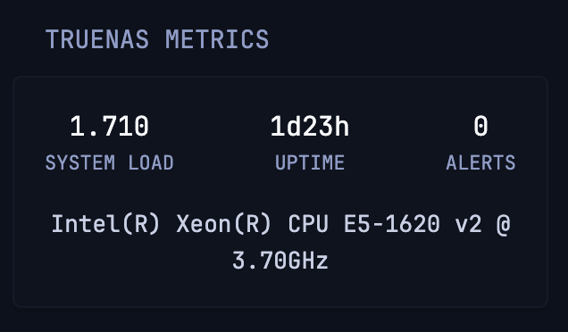

# TrueNAS Metrics

System load average, live uptime, active TrueNAS alerts counter, and CPU model.



```yaml
- type: custom-api
  refresh-interval: 10s
  title: TrueNAS Metrics
  cache: 5s
  url: ${TRUENAS_URL}/api/v2.0/system/info
  headers:
    Authorization: Bearer ${TRUENAS_API_KEY}
  subrequests:
    alerts:
      url: ${TRUENAS_URL}/api/v2.0/alert/list?dismissed=false
      headers:
        Authorization: Bearer ${TRUENAS_API_KEY}
  template: |
    {{- $activeAlerts := 0 -}}
    {{- range (.Subrequest "alerts").JSON.Array "" -}}
      {{- if not (.Bool "dismissed") -}}
        {{- $activeAlerts = add $activeAlerts 1 -}}
      {{- end -}}
    {{- end -}}
    <div class="flex justify-between text-center">
      <div>
        <div class="color-highlight size-h3">{{ printf "%.3f" (.JSON.Float "loadavg.0") }}</div>
        <div class="size-h6">SYSTEM LOAD</div>
      </div>
      <div>
        <div class="color-highlight size-h3">{{ div (.JSON.Int "uptime_seconds") 86400 }}d{{ div (mod (.JSON.Int "uptime_seconds") 86400) 3600 }}h</div>
        <div class="size-h6">UPTIME</div>
      </div>
      <div>
        <div class="color-highlight size-h3">{{ $activeAlerts }}</div>
        <div class="size-h6">ALERTS</div>
      </div>
    </div>
    <div class="text-center margin-top-15">
      <span class="size-p color-paragraph">{{ .JSON.String "model" }}</span>
    </div>
```

## Environment variables

- `TRUENAS_URL` - The full URL of your TrueNAS server, e.g. `http://192.168.1.100` or `https://truenas.local`
- `TRUENAS_API_KEY` - Your TrueNAS API key, generated from Settings -> API Keys
