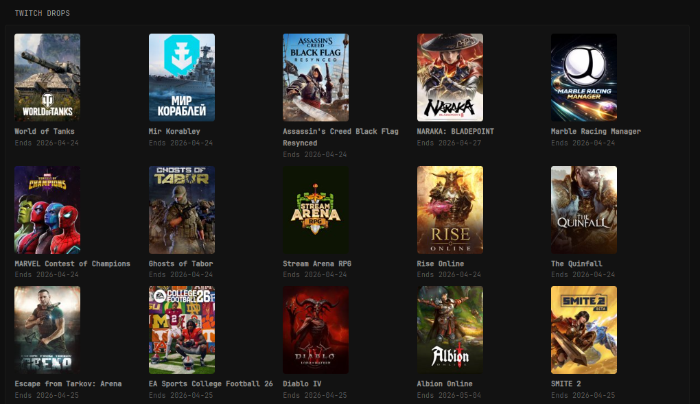

# Twitch Drops

Show active Twitch Drops campaigns with game art and end dates.



```yaml
- type: custom-api
  title: Twitch Drops
  cache: 6h
  url: https://twitch-drops-api.sunkwi.com/drops
  headers:
    Accept: application/json
    User-Agent: Mozilla/5.0
  template: |
    {{ if eq (len (.JSON.Array "")) 0 }}
      <p class="color-negative">No active Twitch drops found.</p>
    {{ else }}
      <div class="cards-grid">
        {{ range .JSON.Array "" }}
          {{ $image := .String "gameBoxArtURL" }}
          {{ $dropID := .String "rewards.0.id" }}
          {{ if eq $dropID "" }}
            {{ $dropID = .String "gameId" }}
          {{ end }}
          <div class="card" style="display:flex;gap:0.75rem;align-items:flex-start;">
            <a href="https://www.twitch.tv/drops/campaigns?dropID={{ $dropID }}" target="_blank" style="flex-shrink:0;">
              
            </a>
            <div class="card-content" style="padding:0;">
              <strong>{{ .String "gameDisplayName" }}</strong>
              <p class="size-small color-subdue">Ends {{ slice (.String "endAt") 0 10 }}</p>
            </div>
          </div>
        {{ end }}
      </div>
    {{ end }}
```

## Notes

Credit to [SunkwiBOT](https://github.com/SunkwiBOT/twitch-drops-api) for the API. Changes to API requests can follow the structure in that github repo.

This widget uses a public Twitch Drops API endpoint and does not require any extra environment variables.
