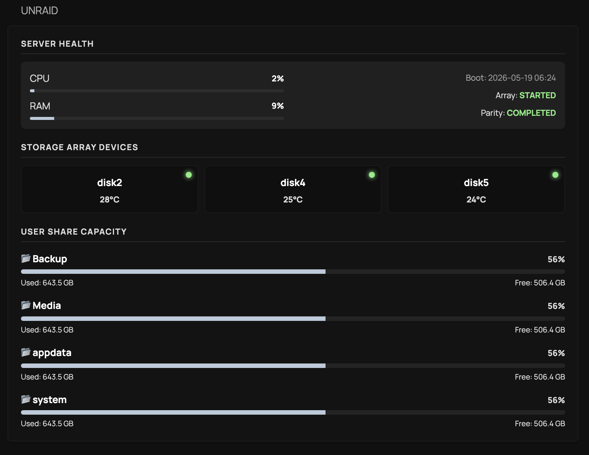

# Unraid Widget
A simple and responsive custom-api widget for monitoring key Unraid information such as the array status, disk status and share capacitities. 

## Required environment variables
|Variable|Description|Example| 
| -------- | -------- | -------- |
| `UNRAID_API_URL`| The full HTTP/HTTPS endpoint of your Unraid GraphQL API Instance.|192.168.1.50/graphql|
| `UNRAID_API_KEY`|The secure authentication token generated by your Unraid API container|b8a7c2...f92a3|

Alternatively you can hard-code the `url:` and `X-API-KEY:` fields.

## Widget



<details>
  <summary>Click to expand wiget code</summary>

```yaml
- type: custom-api
  title: Unraid
  url: ${UNRAID_API_URL}
  method: POST
  body-type: json
  body:
    query: |
      query GetDashboardData {
        info {
          os {
            uptime
          }
        }
        metrics {
          cpu {
            percentTotal
          }
          memory {
            total
            used
            free
            percentTotal
          }
        }
        array {
          state
          parityCheckStatus {
            status
          }
          parities {
            name
            temp
          }
          disks {
            name
            temp
            size
            status
          }
        }
        parityHistory {
          date
          status
          duration
          errors
        }
        shares {
          name
          used
          free
          size
        }
      }
  headers:
    "x-api-key": ${UNRAID_API_KEY}
    Accept: application/json
  skip-json-validation: true
  allow-insecure: true
  template: |
    <div style="display:flex; flex-direction:column; gap:16px;">
      
      <div>
        <div class="size-h6 color-paragraph" style="text-transform:uppercase; font-weight:bold; letter-spacing:1px; border-bottom:1px solid rgba(128,128,128,0.2); padding-bottom:4px; margin-bottom:10px;">
          Server Health
        </div>

        <div style="display:flex; flex-direction:row-reverse; flex-wrap:wrap-reverse; justify-content:space-between; align-items:flex-start; background:rgba(128,128,128,0.1); padding:12px; border-radius:6px; gap:24px;">
          
          <div style="display:flex; flex-direction:column; align-items:flex-end; text-align:right; gap:6px; justify-content:flex-start; flex:1 1 calc(50% - 12px); min-width:200px; box-sizing:border-box;">
            
            {{ $bootRaw := .JSON.String "data.info.os.uptime" }}
            <div class="color-paragraph" style="opacity:0.7; font-size:11px; font-weight:normal; width:100%;">
              Boot: <span style="font-weight:normal; opacity:0.9;">{{ printf "%.10s %.5s" $bootRaw (slice $bootRaw 11 16) }}</span>
            </div>

            {{ $arrayState := .JSON.String "data.array.state" }}
            <div class="color-paragraph" style="font-size:11px; font-weight:normal; width:100%;">
              Array: <span style="font-weight:bold; color:{{ if eq $arrayState "STARTED" }}var(--color-positive){{ else }}var(--color-warning){{ end }};">{{ $arrayState }}</span>
            </div>
            
            {{ $currentParity := .JSON.String "data.array.parityCheckStatus.status" }}
            {{ $lastCheckDate := .JSON.String "data.parityHistory.0.date" }}
            
            <div data-popover-type="text" data-popover-text="Checked: {{ if $lastCheckDate }}{{ printf "%.10s" $lastCheckDate }}{{ else }}Unknown{{ end }}" style="cursor: pointer; width:100%; font-size:11px; font-weight:normal;" class="color-paragraph">
              Parity: <span style="font-weight:bold; color:{{ if eq $currentParity "VALID" "OK" "COMPLETED" }}var(--color-positive){{ else }}var(--color-warning){{ end }};">{{ if $currentParity }}{{ $currentParity }}{{ else }}OK{{ end }}</span>
            </div>

          </div>

          <div style="display:flex; flex-direction:column; gap:10px; flex:1 1 calc(50% - 12px); min-width:200px; box-sizing:border-box;">
            {{ $cpuPct := .JSON.Float "data.metrics.cpu.percentTotal" }}
            {{ $ramPct := .JSON.Float "data.metrics.memory.percentTotal" }}
            
            <div style="display:flex; flex-direction:column; gap:8px; width:100%;">
              <div style="display:flex; flex-direction:column; gap:4px;">
                <div style="display:flex; align-items:center; gap:4px; justify-content:space-between;" class="size-sm">
                  <div style="display:flex; align-items:center; gap:4px;" class="color-paragraph">
                    <span>CPU</span>
                    {{ if ge $cpuPct 80.0 }}
                    <svg style="width:12px; height:12px;" fill="var(--color-negative, #f44336)" xmlns="http://www.w3.org/2000/svg" viewBox="0 0 16 16">
                      <path fill-rule="evenodd" d="M8.074.945A4.993 4.993 0 0 0 6 5v.032c.004.6.114 1.176.311 1.709.16.428-.204.91-.61.7a5.023 5.023 0 0 1-1.868-1.677c-.202-.304-.648-.363-.848-.058a6 6 0 1 0 8.017-1.901l-.004-.007a4.98 4.98 0 0 1-2.18-2.574c-.116-.31-.477-.472-.744-.28Zm.78 6.178a3.001 3.001 0 1 1-3.473 4.341c-.205-.365.215-.694.62-.59a4.008 4.008 0 0 0 1.873.03c.288-.065.413-.386.321-.666A3.997 3.997 0 0 1 8 8.999c0-.585.126-1.14.351-1.641a.42.42 0 0 1 .503-.235Z" clip-rule="evenodd" />
                    </svg>
                    {{ end }}
                  </div>
                  <div class="color-highlight" style="font-weight:bold; font-size:11px;">{{ printf "%.0f" $cpuPct }}%</div>
                </div>
                <div style="width:100%; height:4px; background:rgba(128,128,128,0.15); border-radius:2px; overflow:hidden;">
                  <div style="width: {{ $cpuPct }}%; height:100%; background:{{ if ge $cpuPct 80.0 }}var(--color-negative, #f44336){{ else }}var(--color-primary, #4caf50){{ end }};"></div>
                </div>
              </div>

              <div data-popover-type="text" data-popover-text="Usage: {{ printf "%.0f" $ramPct }}%" style="cursor: pointer; display:flex; flex-direction:column; gap:4px;">
                <div style="width:100%; display:flex; align-items:center; justify-content:space-between;" class="size-sm">
                  <span class="color-paragraph">RAM</span>
                  <div class="color-highlight" style="font-weight:bold; font-size:11px;">{{ printf "%.0f" $ramPct }}%</div>
                </div>
                <div style="width:100%; height:4px; background:rgba(128,128,128,0.15); border-radius:2px; overflow:hidden;">
                  <div style="width: {{ $ramPct }}%; height:100%; background:{{ if ge $ramPct 85.0 }}var(--color-warning, #ff9800){{ else }}var(--color-primary, #4caf50){{ end }};"></div>
                </div>
              </div>
            </div>
          </div>

        </div>
      </div>

      <div>
        <div class="size-h6 color-paragraph" style="text-transform:uppercase; font-weight:bold; letter-spacing:1px; border-bottom:1px solid rgba(128,128,128,0.2); padding-bottom:4px; margin-bottom:10px;">
          Storage Array Devices
        </div>
        <div style="display:grid; grid-template-columns: repeat(3, 1fr); gap:8px;">
          {{ range .JSON.Array "data.array.disks" }}
            {{ $diskName := .String "name" }}
            {{ $diskStatus := .String "status" }}
            {{ $diskTemp := .Float "temp" }}
            
            {{ if not (eq $diskName "flash") }}
              <div style="background:rgba(0,0,0,0.15); padding:8px; border-radius:6px; display:flex; flex-direction:column; align-items:center; justify-content:center; border: 1px solid rgba(128,128,128,0.05); position:relative;">
                
                {{ $isOnline := eq $diskStatus "DISK_OK" "active" "normal" }}
                <div style="position:absolute; top:8px; right:8px; width:8px; height:8px; border-radius:50%; background-color:var(--color-{{ if $isOnline }}positive{{ else }}negative{{ end }}); box-shadow:0 0 6px var(--color-{{ if $isOnline }}positive{{ else }}negative{{ end }});"></div>

                <div class="size-sm color-highlight" style="font-weight:bold; margin-bottom:2px; margin-top:4px;">{{ $diskName }}</div>
                
                {{ if $isOnline }}
                  <div class="size-sm color-paragraph" style="font-size:11px; font-weight:bold; margin-top:2px;">{{ printf "%.0f" $diskTemp }}°C</div>
                {{ else }}
                  <div class="size-sm color-error" style="font-size:10px; font-weight:bold; margin-top:2px;">OFFLINE</div>
                {{ end }}
              </div>
            {{ end }}
          {{ end }}
        </div>
      </div>

      <div>
        <div class="size-h6 color-paragraph" style="text-transform:uppercase; font-weight:bold; letter-spacing:1px; border-bottom:1px solid rgba(128,128,128,0.2); padding-bottom:4px; margin-bottom:12px;">
          User Share Capacity
        </div>
        
        <div style="display:flex; flex-direction:column; gap:12px;">
        {{ range .JSON.Array "data.shares" }}
          {{ $shareName := .String "name" }}
          {{ $usedRaw := .Float "used" }}
          {{ $freeRaw := .Float "free" }}
          
          {{ $totalRaw := add $usedRaw $freeRaw }}
          
          {{ $pctUsed := 0.0 }}
          {{ if lt 0.0 $totalRaw }}
            {{ $pctUsed = mul (div $usedRaw $totalRaw) 100.0 }}
          {{ end }}

          {{ $usedText := "" }}
          {{ if ge $usedRaw 1000000000.0 }}
            {{ $usedText = printf "%.1f TB" (div $usedRaw 1000000000.0) }}
          {{ else }}
            {{ $usedText = printf "%.1f GB" (div $usedRaw 1000000.0) }}
          {{ end }}

          {{ $totalText := "" }}
          {{ if ge $totalRaw 1000000000.0 }}
            {{ $totalText = printf "%.1f TB" (div $totalRaw 1000000000.0) }}
          {{ else }}
            {{ $totalText = printf "%.1f GB" (div $totalRaw 1000000.0) }}
          {{ end }}

          {{ $freeText := "" }}
          {{ if ge $freeRaw 1000000000.0 }}
            {{ $freeText = printf "%.1f TB" (div $freeRaw 1000000000.0) }}
          {{ else }}
            {{ $freeText = printf "%.1f GB" (div $freeRaw 1000000.0) }}
          {{ end }}

          <div style="display:flex; flex-direction:column; gap:4px;">
            <div style="display:flex; justify-content:space-between; align-items: baseline;">
              <span class="size-sm color-highlight" style="font-weight: bold;">📂 {{ $shareName }}</span>
              <span class="size-sm color-paragraph" style="font-size:11px; font-weight:bold;">{{ printf "%.0f%%" $pctUsed }}</span>
            </div>

            <div data-popover-type="text" data-popover-text="Used: {{ $usedText }} / Total: {{ $totalText }}" style="cursor: pointer;">
              <div style="width:100%; height:6px; background:rgba(128, 128, 128, 0.15); border-radius:3px; overflow:hidden;">
                <div style="width: {{ $pctUsed }}%; height:100%; background:{{ if ge $pctUsed 85.0 }}var(--color-warning, #ff9800){{ else }}var(--color-primary, #4caf50){{ end }};"></div>
              </div>
            </div>

            <div style="display:flex; justify-content:space-between; font-size:10px;" class="color-paragraph">
              <span>Used: {{ $usedText }}</span>
              <span>Free: {{ $freeText }}</span>
            </div>
          </div>
        {{ end }}
        </div>
      </div>

    </div>

```
</details>
---

## Known limitations

* **Hardcoded disk grid layout:** The Storage Array grid is currently set to a fixed 3-column layout (`repeat(3, 1fr)`). While this looks clean for smaller setups, systems with a high disk count may require manual adjustments to the CSS grid parameters to display properly.

* **Raw boot timestamp:** The widget currently displays the raw, date and time string returned. Ideally, this would show a dynamic "Uptime in Days" counter (e.g., *Uptime: 2 days*), but handling time-duration math to parse the timestamp into days proved too complex using standard native Glance template strings.

> **Open to input:** If you have any suggestions or input on how to dynamically count array items for the disk layout, or how to implement time math to convert a boot timestamp into uptime days.

---
**Developed by:** [@eddydmate](https://github.com/eddydmate/)