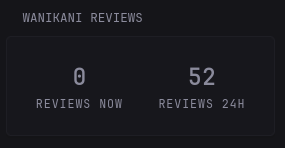
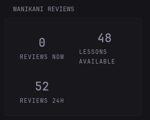
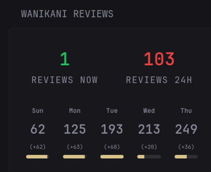

# Wanikani Reviews Widget

Small widget that shows your Wanikani reviews (and next 24 hours) (and lessons)







## Environment Variables
`WANIKANI_API_KEY` - Your (read-only) Wanikani API key, you can get this from the website under settings.

## Settings
You can set lessons to true or false, depending on whether you want to see the number of lessons available. 

This does not show the number as on the website, but rather the actual total.

You can set future to true or false, and it will show you a similar sort of bars as on the website dashboard.


## Code
```yaml
- type: custom-api
  title: Wanikani reviews
  frameless: false
  cache: 5m
  options:
    api-base-url: "https://api.wanikani.com/v2"
    api-key: ${WANIKANI_API_KEY}
    lessons: false
    future: true
  template: |
    {{ $apiBaseUrl := .Options.StringOr "api-base-url" "" }}
    {{ $apiKey := .Options.StringOr "api-key" "" }}
    {{ $lessons := .Options.BoolOr "lessons" true }}
    {{ $future := .Options.BoolOr "future" true }}

    {{ if or (eq $apiBaseUrl "") (eq $apiKey "") }}
      <div class="widget-error-header">
        <div class="color-negative size-h3">ERROR</div>
        <p class="break-all">Missing Wanikani URL or API key.</p>
      </div>
    {{ else }}
      {{ $summaryUrl := printf "%s/summary" (trimSuffix "/" $apiBaseUrl) }}

      {{ $summaryResponse := newRequest $summaryUrl
          | withHeader "Accept" "application/json"
          | withHeader "Wanikani-Revision" "20170710"
          | withHeader "Authorization" (printf "Bearer %s" $apiKey)
          | getResponse }}

      {{ $reviewsNowCount := 0 }}
      {{ $reviewsUpcomingCount := 0 }}
      {{ $reviewIndex := 0 }}
      {{ range $summaryResponse.JSON.Array "data.reviews" }}
        {{ if eq $reviewIndex 0 }}
          {{ $reviewsNowCount = len (.Array "subject_ids") }}
        {{ else }}
          {{ $reviewsUpcomingCount = add $reviewsUpcomingCount (len (.Array "subject_ids")) }}
        {{ end }}
        {{ $reviewIndex = add $reviewIndex 1 }}
      {{ end }}

      {{ $lessonsTotal := 0 }}
      {{ $lessonsUpcomingCount := 0 }}
      {{ $lessonIndex := 0 }}
      {{ $utcLocation := (parseTime "MST" "UTC").Location }}
      {{ $todayDate := now.In $utcLocation | formatTime "2006-01-02" }}
      {{ $day1Date := (offsetNow "+24h").In $utcLocation | formatTime "2006-01-02" }}
      {{ $day2Date := (offsetNow "+48h").In $utcLocation | formatTime "2006-01-02" }}
      {{ $day3Date := (offsetNow "+72h").In $utcLocation | formatTime "2006-01-02" }}
      {{ $day4Date := (offsetNow "+96h").In $utcLocation | formatTime "2006-01-02" }}
      {{ $day0Label := now.In $utcLocation | formatTime "Mon" }}
      {{ $day1Label := (offsetNow "+24h").In $utcLocation | formatTime "Mon" }}
      {{ $day2Label := (offsetNow "+48h").In $utcLocation | formatTime "Mon" }}
      {{ $day3Label := (offsetNow "+72h").In $utcLocation | formatTime "Mon" }}
      {{ $day4Label := (offsetNow "+96h").In $utcLocation | formatTime "Mon" }}

      {{ $reviewDay0 := 0 }}
      {{ $reviewDay1 := 0 }}
      {{ $reviewDay2 := 0 }}
      {{ $reviewDay3 := 0 }}
      {{ $reviewDay4 := 0 }}

      {{ $reviewsNext24hCount := $reviewsNowCount }}
      {{ $next24Deadline := (offsetNow "+24h").In $utcLocation | formatTime "2006-01-02T15:04:05" }}
      {{ range $summaryResponse.JSON.Array "data.lessons" }}
        {{ $lessonsTotal = add $lessonsTotal (len (.Array "subject_ids")) }}
        {{ if ne $lessonIndex 0 }}
          {{ $lessonsUpcomingCount = add $lessonsUpcomingCount (len (.Array "subject_ids")) }}
        {{ end }}
        {{ $lessonIndex = add $lessonIndex 1 }}
      {{ end }}

      {{ $day5Date := (offsetNow "+120h").In $utcLocation | formatTime "2006-01-02" }}
      {{ $assignmentStartISO := now.In $utcLocation | formatTime "2006-01-02T15:04:05Z" }}
      {{ $assignmentEndISO := (printf "%sT00:00:00Z" $day5Date) }}
      {{ $assignmentsUrl := printf "%s/assignments?available_after=%s&available_before=%s&hidden=false&burned=false&in_review=true&per_page=500" (trimSuffix "/" $apiBaseUrl) $assignmentStartISO $assignmentEndISO }}
      {{ $assignmentsResponse := newRequest $assignmentsUrl
          | withHeader "Accept" "application/json"
          | withHeader "Wanikani-Revision" "20170710"
          | withHeader "Authorization" (printf "Bearer %s" $apiKey)
          | getResponse }}
      {{ range $assignmentsResponse.JSON.Array "data" }}
        {{ $assignmentAtString := .String "data.available_at" }}
        {{ if ne $assignmentAtString "" }}
          {{ $assignmentDate := ($assignmentAtString | parseTime "RFC3339" | formatTime "2006-01-02") }}
          {{ $assignmentTime := ($assignmentAtString | parseTime "RFC3339" | formatTime "15:04:05") }}
          {{ if and (eq $assignmentTime "00:00:00") (ne $assignmentDate $todayDate) }}
          {{ else if eq $assignmentDate $todayDate }}
            {{ $reviewDay0 = add $reviewDay0 1 }}
          {{ else if eq $assignmentDate $day1Date }}
            {{ $reviewDay1 = add $reviewDay1 1 }}
          {{ else if eq $assignmentDate $day2Date }}
            {{ $reviewDay2 = add $reviewDay2 1 }}
          {{ else if eq $assignmentDate $day3Date }}
            {{ $reviewDay3 = add $reviewDay3 1 }}
          {{ else if eq $assignmentDate $day4Date }}
            {{ $reviewDay4 = add $reviewDay4 1 }}
          {{ end }}
        {{ end }}
      {{ end }}

      {{ $reviewIndex = 0 }}
      {{ range $summaryResponse.JSON.Array "data.reviews" }}
        {{ if ne $reviewIndex 0 }}
          {{ $reviewsNext24hCount = add $reviewsNext24hCount (len (.Array "subject_ids")) }}
        {{ end }}
        {{ $reviewIndex = add $reviewIndex 1 }}
      {{ end }}
      {{ $reviewCum0 := $reviewDay0 }}
      {{ $reviewCum1 := add $reviewCum0 $reviewDay1 }}
      {{ $reviewCum2 := add $reviewCum1 $reviewDay2 }}
      {{ $reviewCum3 := add $reviewCum2 $reviewDay3 }}
      {{ $reviewCum4 := add $reviewCum3 $reviewDay4 }}
      {{ $maxReviewDay := $reviewCum0 }}
      {{ if gt $reviewCum1 $maxReviewDay }}{{ $maxReviewDay = $reviewCum1 }}{{ end }}
      {{ if gt $reviewCum2 $maxReviewDay }}{{ $maxReviewDay = $reviewCum2 }}{{ end }}
      {{ if gt $reviewCum3 $maxReviewDay }}{{ $maxReviewDay = $reviewCum3 }}{{ end }}
      {{ if gt $reviewCum4 $maxReviewDay }}{{ $maxReviewDay = $reviewCum4 }}{{ end }}

      {{ $reviewsNowColor := "#22c55e" }}
      {{ if ge $reviewsNowCount 50 }}{{ $reviewsNowColor = "#fbbf24" }}{{ end }}
      {{ if ge $reviewsNowCount 100 }}{{ $reviewsNowColor = "#ef4444" }}{{ end }}

      {{ $reviewsUpcomingColor := "#22c55e" }}
      {{ if ge $reviewsUpcomingCount 50 }}{{ $reviewsUpcomingColor = "#fbbf24" }}{{ end }}
      {{ if ge $reviewsUpcomingCount 100 }}{{ $reviewsUpcomingColor = "#ef4444" }}{{ end }}

      <div style="display:grid; grid-template-columns:repeat(2, minmax(0,1fr)); gap:1rem; min-height:8rem;">
        <div style="display:flex; flex-direction:column; align-items:center; justify-content:center; padding:0.75rem; border-radius:0.75rem; background:var(--surface-secondary);">
          <div style="font-size:2.5rem; font-weight:700; color:{{ $reviewsNowColor }};">{{ $reviewsNowCount }}</div>
          <div style="text-transform:uppercase; letter-spacing:0.08em; color:var(--color-subdue);">Reviews now</div>
        </div>
        {{ if $lessons }}
        <div style="display:flex; flex-direction:column; align-items:center; justify-content:center; padding:0.75rem; border-radius:0.75rem; background:var(--surface-secondary);">
          <div style="font-size:2.5rem; font-weight:700;">{{ $lessonsTotal }}</div>
          <div style="text-transform:uppercase; letter-spacing:0.08em; color:var(--color-subdue);">Lessons available</div>
        </div>
        {{ end }}
        <div style="display:flex; flex-direction:column; align-items:center; justify-content:center; padding:0.75rem; border-radius:0.75rem; background:var(--surface-secondary);">
          <div style="font-size:2.5rem; font-weight:700; color:{{ $reviewsUpcomingColor }};">{{ $reviewsUpcomingCount }}</div>
          <div style="text-transform:uppercase; letter-spacing:0.08em; color:var(--color-subdue);">Reviews 24h</div>
        </div>
      </div>

      {{ if $future }}
      {{ $reviewDayMax := $reviewDay0 }}
      {{ if gt $reviewDay1 $reviewDayMax }}{{ $reviewDayMax = $reviewDay1 }}{{ end }}
      {{ if gt $reviewDay2 $reviewDayMax }}{{ $reviewDayMax = $reviewDay2 }}{{ end }}
      {{ if gt $reviewDay3 $reviewDayMax }}{{ $reviewDayMax = $reviewDay3 }}{{ end }}
      {{ if gt $reviewDay4 $reviewDayMax }}{{ $reviewDayMax = $reviewDay4 }}{{ end }}
        <div style="margin-top:1rem; display:flex; flex-direction:column; gap:1rem;">
          <div style="display:grid; grid-template-columns:repeat(5, minmax(0, 1fr)); gap:0.5rem;">
            <div style="display:flex; flex-direction:column; align-items:center; gap:0.5rem; padding:0.75rem; border-radius:0.75rem; background:var(--surface-secondary);">
              <div style="font-size:0.9rem; font-weight:700;">{{ $day0Label }}</div>
              <div style="font-size:1.8rem; font-weight:700;">{{ $reviewCum0 }}</div>
              <div style="font-size:0.8rem; color:var(--color-subdue);">(+{{ $reviewDay0 }})</div>
              <div style="width:100%; height:0.5rem; background:rgba(255,255,255,0.1); border-radius:999px; overflow:hidden;">
                <div style="width:{{ if gt $reviewDayMax 0 }}{{ div (mul 100 $reviewDay0) $reviewDayMax }}%{{ else }}0%{{ end }}; height:100%; background:var(--color-positive);"></div>
              </div>
            </div>
            <div style="display:flex; flex-direction:column; align-items:center; gap:0.5rem; padding:0.75rem; border-radius:0.75rem; background:var(--surface-secondary);">
              <div style="font-size:0.9rem; font-weight:700;">{{ $day1Label }}</div>
              <div style="font-size:1.8rem; font-weight:700;">{{ $reviewCum1 }}</div>
              <div style="font-size:0.8rem; color:var(--color-subdue);">(+{{ $reviewDay1 }})</div>
              <div style="width:100%; height:0.5rem; background:rgba(255,255,255,0.1); border-radius:999px; overflow:hidden;">
                <div style="width:{{ if gt $reviewDayMax 0 }}{{ div (mul 100 $reviewDay1) $reviewDayMax }}%{{ else }}0%{{ end }}; height:100%; background:var(--color-positive);"></div>
              </div>
            </div>
            <div style="display:flex; flex-direction:column; align-items:center; gap:0.5rem; padding:0.75rem; border-radius:0.75rem; background:var(--surface-secondary);">
              <div style="font-size:0.9rem; font-weight:700;">{{ $day2Label }}</div>
              <div style="font-size:1.8rem; font-weight:700;">{{ $reviewCum2 }}</div>
              <div style="font-size:0.8rem; color:var(--color-subdue);">(+{{ $reviewDay2 }})</div>
              <div style="width:100%; height:0.5rem; background:rgba(255,255,255,0.1); border-radius:999px; overflow:hidden;">
                <div style="width:{{ if gt $reviewDayMax 0 }}{{ div (mul 100 $reviewDay2) $reviewDayMax }}%{{ else }}0%{{ end }}; height:100%; background:var(--color-positive);"></div>
              </div>
            </div>
            <div style="display:flex; flex-direction:column; align-items:center; gap:0.5rem; padding:0.75rem; border-radius:0.75rem; background:var(--surface-secondary);">
              <div style="font-size:0.9rem; font-weight:700;">{{ $day3Label }}</div>
              <div style="font-size:1.8rem; font-weight:700;">{{ $reviewCum3 }}</div>
              <div style="font-size:0.8rem; color:var(--color-subdue);">(+{{ $reviewDay3 }})</div>
              <div style="width:100%; height:0.5rem; background:rgba(255,255,255,0.1); border-radius:999px; overflow:hidden;">
                <div style="width:{{ if gt $reviewDayMax 0 }}{{ div (mul 100 $reviewDay3) $reviewDayMax }}%{{ else }}0%{{ end }}; height:100%; background:var(--color-positive);"></div>
              </div>
            </div>
            <div style="display:flex; flex-direction:column; align-items:center; gap:0.5rem; padding:0.75rem; border-radius:0.75rem; background:var(--surface-secondary);">
              <div style="font-size:0.9rem; font-weight:700;">{{ $day4Label }}</div>
              <div style="font-size:1.8rem; font-weight:700;">{{ $reviewCum4 }}</div>
              <div style="font-size:0.8rem; color:var(--color-subdue);">(+{{ $reviewDay4 }})</div>
              <div style="width:100%; height:0.5rem; background:rgba(255,255,255,0.1); border-radius:999px; overflow:hidden;">
                <div style="width:{{ if gt $reviewDayMax 0 }}{{ div (mul 100 $reviewDay4) $reviewDayMax }}%{{ else }}0%{{ end }}; height:100%; background:var(--color-positive);"></div>
              </div>
            </div>
          </div>
        </div>
      {{ end }}
    {{ end }}
    
```