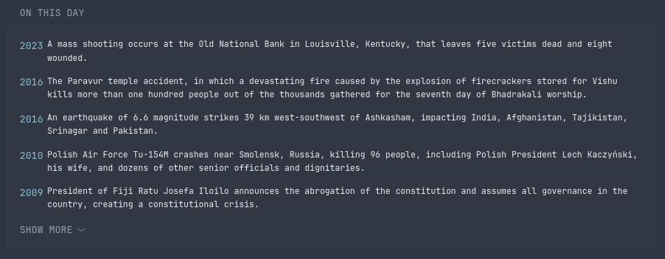

# Wikipedia On This Day

Shows notable historical events that happened on today's date, pulled live from Wikipedia's public REST API. No API key required.

The widget fetches Wikipedia's [`feed/onthisday/events/{MM}/{DD}`](https://en.wikipedia.org/api/rest_v1/#/Feed/onThisDay) endpoint using today's date, computed inside the template so the URL stays dynamic without any backend.

## Configuration

No setup needed — the Wikipedia REST API is free and public. If you want a different language edition, change `en` in the URL to another Wikipedia language code (e.g. `de`, `fr`, `ja`).

## Widget

```yaml
- type: custom-api
  title: On This Day
  cache: 6h
  url: https://api.github.com/rate_limit
  template: |
    {{/* Top-level URL is a cheap dummy JSON; the real work is done inside the template via newRequest so we can compute today's date. Wikipedia's REST API requires a descriptive User-Agent per their policy (https://meta.wikimedia.org/wiki/User-Agent_policy) — an unset UA returns 403. */}}
    {{ $month := now | formatTime "01" }}
    {{ $day := now | formatTime "02" }}
    {{ $url := concat "https://en.wikipedia.org/api/rest_v1/feed/onthisday/events/" $month "/" $day }}
    {{
      $resp := newRequest $url
        | withHeader "Accept" "application/json"
        | withHeader "User-Agent" "glance-dashboard/1.0 (+https://github.com/glanceapp/glance)"
        | getResponse
    }}

    {{ if ne $resp.Response.StatusCode 200 }}
      <p class="color-negative">Failed to load Wikipedia events ({{ $resp.Response.Status }})</p>
    {{ else }}
      {{ $events := $resp.JSON.Array "events" }}
      {{ if eq (len $events) 0 }}
        <p class="color-subdue">No events found for today.</p>
      {{ else }}
        <ul class="list list-gap-14 collapsible-container" data-collapse-after="5">
          {{ range $events }}
            {{ $year := .Int "year" }}
            {{ $text := .String "text" }}
            {{ $pages := .Array "pages" }}
            {{ $link := "" }}
            {{ if gt (len $pages) 0 }}
              {{ $firstPage := index $pages 0 }}
              {{ $link = $firstPage.String "content_urls.desktop.page" }}
            {{ end }}
            <li>
              <div class="flex items-baseline" style="gap: 0.6rem;">
                <span class="color-primary size-h4" style="flex: 0 0 auto; min-width: 3rem;">{{ $year }}</span>
                <span class="size-h5" style="flex: 1 1 auto;">
                  {{ if ne $link "" }}
                    <a href="{{ $link }}" target="_blank" rel="noreferrer" class="color-highlight">{{ $text }}</a>
                  {{ else }}
                    {{ $text }}
                  {{ end }}
                </span>
              </div>
            </li>
          {{ end }}
        </ul>
      {{ end }}
    {{ end }}
```

## Variants

### Births

Swap `events` in the `$url` line for `births` to show notable people born today.

```go
{{ $url := concat "https://en.wikipedia.org/api/rest_v1/feed/onthisday/births/" $month "/" $day }}
```

### Deaths

```go
{{ $url := concat "https://en.wikipedia.org/api/rest_v1/feed/onthisday/deaths/" $month "/" $day }}
```

### All categories combined

The `all` type returns events, births, deaths, holidays, and selected items in one payload. You can iterate `.Array "selected"` or `.Array "events"` etc:

```go
{{ $url := concat "https://en.wikipedia.org/api/rest_v1/feed/onthisday/all/" $month "/" $day }}
```

## Notes

- The top-level `url:` field is a dummy cheap Wikipedia call (random page summary). Glance's `custom-api` requires a URL at the top level, but the real work is done inside the template via `newRequest` so the date can be computed dynamically.
- Cache is set to `6h` — the content rolls over once a day, so anything from 1h to 12h is reasonable.
- Wikipedia's API is rate-limited to ~200 req/s anonymous. At 6h cache you'll make ~4 requests/day per user — well under the limit.
- Please set a descriptive `Api-User-Agent` header when using Wikipedia's APIs in production ([per their policy](https://meta.wikimedia.org/wiki/User-Agent_policy)).
