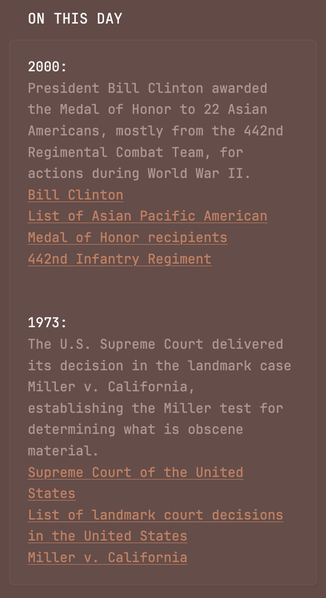

# wikipedia widgets

a series of widgets based on the wikifeeds API. 

note: this particular api is scheduled for (gradual deprecation)[https://www.mediawiki.org/wiki/Wikifeeds_API] next month. i will keep an eye on these and update as needed!

you will need to set the following environment variables:
```
LANGUAGE="<your_desired_language_code>"
USERAGENT="<your_header>
# language codes reference: https://meta.wikimedia.org/wiki/Special:SiteMatrix
# user agent can be an identifier like your name and email, or can be the run-of-the-mill user agent header
```


widgets are currently for: on this day, most read articles, featured article, featured image, and did you know


## small widgets 

### on this day
```
        - type: custom-api
          title: on this day
          cache: 3h
          template: |
            {{ $m := now | formatTime "01" }}
            {{ $d := now | formatTime "02" }}
            {{ $url := printf "https://api.wikimedia.org/feed/v1/wikipedia/${LANAGUAGE}/onthisday/selected/%s/%s" $m $d }}
            {{
              $events := newRequest $url
                | withHeader "User-Agent" "${USERAGENT}"
                | getResponse
            }}
            
            {{ if eq $events.Response.StatusCode 200 }}
              <div style="display: block; align-items: center; overflow-y: auto; scrollbar-behavior: smooth; max-height: 500px; scrollbar-width: none; gap: 20px;">
                {{ range $events.JSON.Array "selected" }}
                  <div style="display: block; align-items: center;">
                    <h2 style="font-style: bold;">{{ .String "year" }}: </h2>
                    <p>{{ .String "text" }}</p>
                    {{ range .Array "pages" }}
                      <a style="text-decoration: underline;" href={{ .String "content_urls.desktop.page" }}>{{ .String "titles.normalized" }}</a><br>
                    {{ end }}
                    <br>
                    <br>
                  </div>
                {{ end }}
              </div>
            {{ else }}
              <p>Failed to fetch data: {{ $events.Response.Status }}</p>
            {{ end }}
```


### did you know
```
        - type: custom-api
          title: did you know
          cache: 1h
          template: |
            {{ $y := now | formatTime "2006" }}
            {{ $m := now | formatTime "01" }}
            {{ $d := now | formatTime "02" }}
            {{ $url := printf "https://api.wikimedia.org/feed/v1/wikipedia/${LANGUAGE}/featured/%s/%s/%s" $y $m $d }}
            {{
              $events := newRequest $url
                | withHeader "User-Agent" "${USERAGENT}"
                | getResponse
            }}
            
            {{ if eq $events.Response.StatusCode 200 }}
              <div style="display: block; align-items: center; overflow-y: auto; scrollbar-behavior: smooth; max-height: 250px; scrollbar-width: none; gap: 20px;">
                {{ range $events.JSON.Array "dyk" }}
                  <div style="display: block; align-items: center;">
                    {{ .String "text" }}
                  </div>
                  <br>
                  <br>
                {{ end }}
              </div>
            {{ else }}
              <p>Failed to fetch data: {{ $events.Response.Status }}</p>
            {{ end }}
```
![preview of the 'did you know' widget]{./didyouknow_preview.png}

## full-sized widgets

### most read
```
        - type: custom-api
          title: most read articles
          cache: 6h
          template: |
            {{ $y := now | formatTime "2006" }}
            {{ $m := now | formatTime "01" }}
            {{ $d := now | formatTime "02" }}
            {{ $url := printf "https://api.wikimedia.org/feed/v1/wikipedia/${LANGUAGE}/featured/%s/%s/%s" $y $m $d }}
            {{
              $featured := newRequest $url
                | withHeader "User-Agent" "${USERAGENT}"
                | getResponse
            }}

            {{ if eq $featured.Response.StatusCode 200 }}
              <div style="display: flex; overflow-x: auto; gap: 30px; padding-block: 10px; scroll-behavior: smooth; scrollbar-width: none; -ms-overflow-style: none;">
                {{ range $featured.JSON.Array "mostread.articles" }}
                <div style="display: block; align-items: center;">
                  <h2 style="font-style: bold;">{{ .String "titles.normalized" }}</h2>
                  <a href="{{ .String "content_urls.desktop.page" }}"></a>
                  <p>{{ .String "description" }}</p>
                </div>
                {{ end }}
              </div>
            {{ else }}
              <p>Failed to fetch data: {{ $featured.Response.Status }}</p>              
            {{ end }}
```
![preview of the most read articles widget]{./mostread_preview.png}

### featured article
```
        - type: custom-api
          title: featured article
          cache: 6h
          template: |
            {{ $y := now | formatTime "2006" }}
            {{ $m := now | formatTime "01" }}
            {{ $d := now | formatTime "02" }}
            {{ $url := printf "https://api.wikimedia.org/feed/v1/wikipedia/${LANGUAGE}/featured/%s/%s/%s" $y $m $d }}
            {{
              $featured := newRequest $url
                | withHeader "User-Agent" "${USERAGENT}"
                | getResponse
            }}

            {{ if eq $featured.Response.StatusCode 200 }}
              <div style="display: grid; grid-template-columns: 1fr 2fr; gap: 20px">
                <div>
                  
                </div>
                <div>
                  <h2 font-style="bold">{{ $featured.JSON.String "tfa.titles.normalized" }}</h2>
                  <br>
                  <p>{{ $featured.JSON.String "tfa.extract" }}</p>
                  <br>
                  <a style="text-decoration: underline;" href="{{ $featured.JSON.String "tfa.content_urls.desktop.page" }}>read more</a>
                </div>
              </div>
            {{ else }}
              <p>Failed to fetch data: {{ $featured.Response.Status }}</p>   
            {{ end }}
```
![preview of the featured article of the day]{./featured_preview.png}

### featured image
```
        - type: custom-api
          title: featured image
          cache: 6h
          template: |
            {{ $y := now | formatTime "2006" }}
            {{ $m := now | formatTime "01" }}
            {{ $d := now | formatTime "02" }}
            {{ $url := printf "https://api.wikimedia.org/feed/v1/wikipedia/${LANGUAGE}/featured/%s/%s/%s" $y $m $d }}
            {{
              $featured := newRequest $url
                | withHeader "User-Agent" "${USERAGENT}$"
                | getResponse
            }}

            {{ if eq $featured.Response.StatusCode 200 }}
              <div style="display: block; align-items: center;">
                <a href="{{ $featured.JSON.String "image.file_page" }}"></a>
                <h2 style="font-style: bold;">{{ $featured.JSON.String "image.description.text" }}</h2>
                <p>uploaded by: {{ $featured.JSON.String "image.artist.text" }}, <em>{{ $featured.JSON.String "image.credit.text" }}</em></p>
                <p style="font-style: bold;">{{ $featured.JSON.String "image.license.type" }}</p>
              </div>
            {{ else }}
              <p>Failed to fetch data: {{ $featured.Response.Status }}</p>              
            {{ end }}
```
![preview of the featured wikimedia image of the day]{./featuredimage_preview}