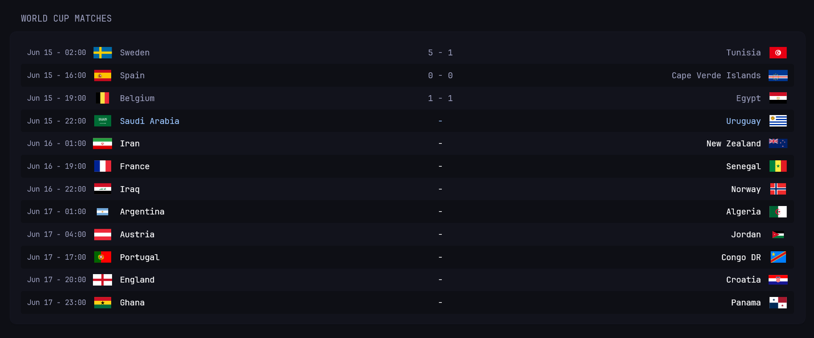

## Prerequisites

Create a __**free**__ account at [`football-data`](https://www.football-data.org/).  
You will receive an email with your *Authentication Token*.  
Add your token to your `.env` file under the name `FOOTBALL_DATA_API_AUTH_TOKEN` as follows:

```bash
# .env
FOOTBALL_DATA_API_AUTH_TOKEN=<your token here>
```

## Config

### Options
1. `show-datetime`: boolean, defaults to `true`.
2. `show-flags`: boolean, defaults to `true`.
3. `country-format`: controls the name of countries, supports values `short` and `long`, defaults to `long`.


Optionally, you can controls the date range in which the API filters world cup matches. You will find this in the first 2 lines of the template, and you can change the `$now` and `$tmw` variables with offset time values as you please.

*Note: This widget is not meant for live scores, as there is a limit of 100 requests per hour on the free tier accounts. Therefore, the cache time has been set to 1h.*

<details>
<summary>See Config `.yml` here</summary>

```yml
- type: custom-api
  title: World Cup Matches
  cache: 1h
  options:
    show-datetime: true
    show-flags: true
    country-format: long
  template: |
    {{ $now := offsetNow "-6h" | formatTime "DateOnly" }}
    {{ $tmw := offsetNow "48h" | formatTime "DateOnly" }}

    {{ $showDateTime := .Options.BoolOr "show-datetime" true }}
    {{ $showFlags := .Options.BoolOr "show-flags" true }}
    {{ $countryFormat := .Options.StringOr "country-format" "short" }}

    {{
      $response := newRequest "https://api.football-data.org/v4/matches"
        | withParameter "dateFrom" $now
        | withParameter "dateTo" $tmw
        | withHeader "X-Auth-Token" "${FOOTBALL_DATA_API_AUTH_TOKEN}"
        | getResponse
    }}

    {{ if ne $response.Response.StatusCode 200 }}
      <div class="widget-error-header">
        <p class="color-negative">Failed to get matches: {{ $response.Response.Status }}</p>
      </div>
    {{ else }}
      <ul class="list">
        {{ range $i, $v := $response.JSON.Array "matches" }}
        {{ $odd := eq (mod $i 2) 1 }}
        <li
          style="display: grid; grid-template-columns: {{ if $showDateTime }}12ch{{ end }} 1fr auto 1fr; padding: 0.75rem 1rem; border-radius: 4px;{{ if $odd }}background-color: var(--color-background);{{ end }}"
          class="items-center justify-between gap-10 {{ if or (eq (.String "status") "IN_PLAY") (eq (.String "status") "PAUSED") }}color-primary{{ else if eq (.String "status") "TIMED" }}color-highlight{{ end }}"
        >
          {{ if $showDateTime }}
            <p class="color-base size-h6">{{ (.String "utcDate" | parseLocalTime "rfc3339").In now.Location | formatTime "Jan 02 - 15:04" }}</p>
          {{ end }}

          <p style="text-wrap: nowrap;" class="flex items-center gap-12">
            {{ if $showFlags }}
              
            {{ end }}
            <span>
              {{ if eq $countryFormat "short" }}
                {{ .String "homeTeam.tla" }}
              {{ else if eq $countryFormat "long" }}
                {{ .String "homeTeam.name" }}
              {{ else }}
                {{ .String "homeTeam.shortName" }}
              {{ end }}
            </span>
          </p>

          <span class="text-center">
          {{ if or (eq (.String "status") "FINISHED") (eq (.String "status") "IN_PLAY") }}
            {{ .String "score.fullTime.home" }} - {{ .String "score.fullTime.away" }}
          {{ else }}
            - 
          {{ end }}
          </span>

          <p style="text-wrap: nowrap;" class="text-right flex items-center justify-end gap-12">
            <span>
              {{ if eq $countryFormat "short" }}
                {{ .String "awayTeam.tla" }}
              {{ else if eq $countryFormat "long" }}
                {{ .String "awayTeam.name" }}
              {{ else }}
                {{ .String "awayTeam.shortName" }}
              {{ end }}
            </span>
            {{ if $showFlags }}
              
            {{ end }}
          </p>
        </li>
        {{ end }}
      </ul>
    {{ end }}
```
</details>

## Preview


